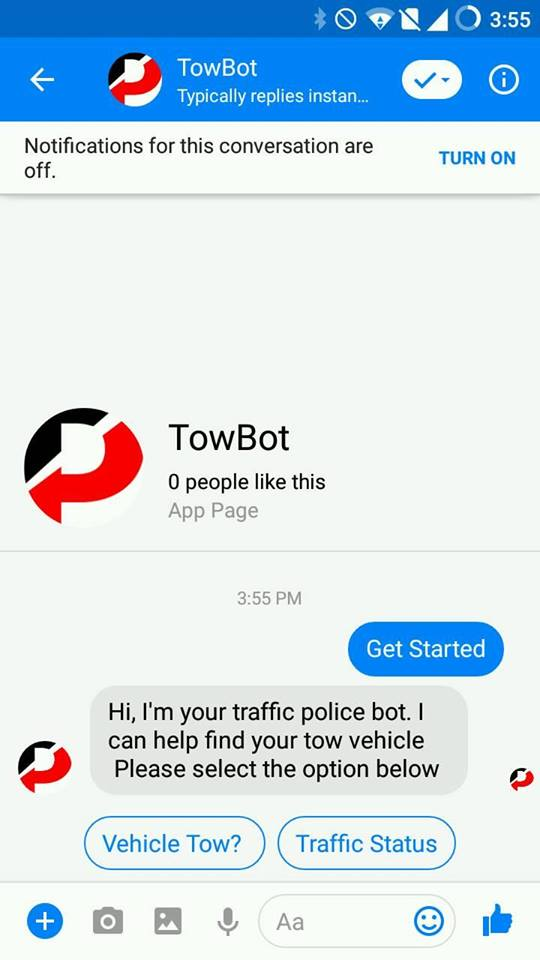
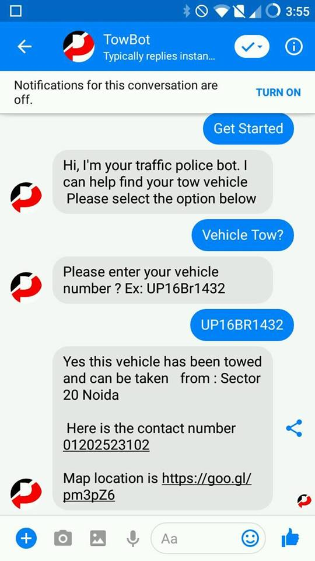
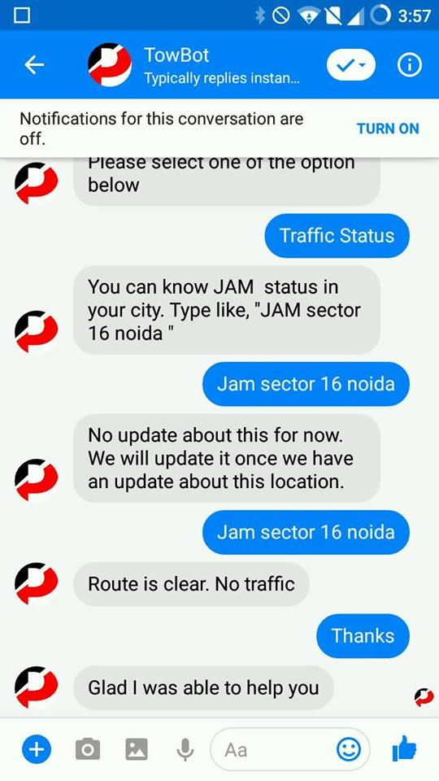

# TowBot

## What is TowBot?

TowBot is a facebook messenger bot. 

## What it does?

It lets the owner of vehicle know whether their vehicle has been towed or not in <b>real time</b>. And if "Yes" . Then where vehicle has been taken and to whom to contact.

## But who can update the detail about the vehicle?

The person who has been authorized by the organization to tow the vehicle. Ex.  Police Officer.

## How Police Officer or Authorized person can update details about vehicle?

For officers there is a separate android client (app) which they can use to update details.

## What if officer doesn't have an internet connection?

There is a <b>web app</b> also.  
In that case officer can contact the server room , and the person in the server room can add the details of the vehilce using the web app. 

### Can anyone use that app?
 
Organization generate unique email and password for each officer. Only with those credentials user (officers) can login.
 
## Tech Stack

Firebase - For <b>Real Time Database</b> and for <b>Hosting</b>  
DialogFlow - For <b>Natural Language Processing</b>  
Messenger Api - For Sending And Receiving Messages.  
Android App - Java  
Web App - Node.js, Express.js  

## Links

URL for towbot web interface:
 https://towbotweb.herokuapp.com/
 
 URL for android app apk
 https://github.com/NikhilDhyani/TowBot/blob/master/app-debug.apk
 
 
 URL for messenger bot
 https://www.facebook.com/TowBot-2208318472529292/?view_public_for=2208318472529292
 
Get Started

Vehicle Tow

Traffic Status

